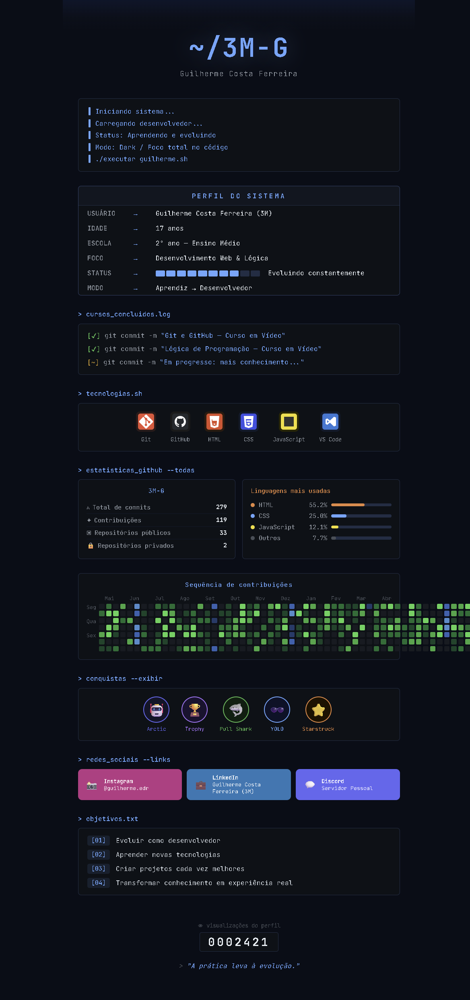

<div align="center">



</div>

---

```bash
▌ Iniciando sistema...
▌ Carregando desenvolvedor...
▌ Status: Aprendendo e evoluindo
▌ Modo: Dark / Foco total no código
▌ ./executar guilherme.sh
```

---

<div align="center">

```
╔══════════════════ PERFIL DO SISTEMA ═══════════════════╗
║                                                        ║
║  USUÁRIO  →  Guilherme Costa Ferreira (3M)             ║
║  IDADE    →  17 anos                                   ║
║  ESCOLA   →  2º ano — Ensino Médio                     ║
║  FOCO     →  Desenvolvimento Web & Lógica              ║
║  STATUS   →  [████████░░] Evoluindo constantemente     ║
║  MODO     →  Aprendiz → Desenvolvedor                  ║
║                                                        ║
╚════════════════════════════════════════════════════════╝
```

</div>

---

**`> cursos_concluidos.log`**

```
[✔] git commit -m "Git e GitHub — Curso em Vídeo"
[✔] git commit -m "Lógica de Programação — Curso em Vídeo"
[~] git commit -m "Em progresso: mais conhecimento..."
```

---

**`> tecnologias.sh`**

<div align="center">

[](https://skillicons.dev)

</div>

---

**`> estatisticas_github --todas`**

<div align="center">


</div>

---

**`> sequencia_contribuicoes`**

<div align="center">

[](https://git.io/streak-stats)

</div>

---

**`> conquistas --exibir`**

<div align="center">


</div>

---

**`> redes_sociais --links`**

<div align="center">

[](https://www.instagram.com/guilherme.edr/)&nbsp;
[-0077B5?style=for-the-badge&logo=linkedin&logoColor=white)](www.linkedin.com/in/guilherme-costa-ferreira-3m)&nbsp;
[](https://discord.gg/TWn2NueW)

</div>

---

**`> objetivos.txt`**

```
[01] Evoluir como desenvolvedor
[02] Aprender novas tecnologias
[03] Criar projetos cada vez melhores
[04] Transformar conhecimento em experiência real
```

---

<div align="center">


> *"A prática leva à evolução."*

</div>
