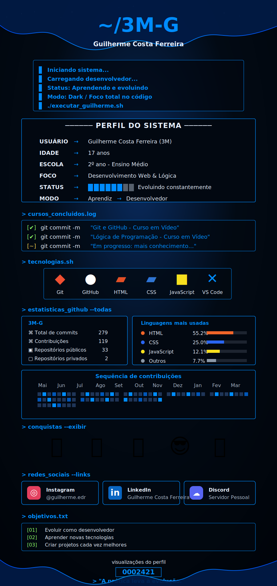

<div align="center">



</div>

<!--
README vitrine inspirado na arte original.
Para aparecer igual no GitHub, mantenha a imagem em:
assets/github-profile-vitrine.svg
-->

<div align="center">

## ~/3M-G

**Guilherme Costa Ferreira**

`Aprendiz -> Desenvolvedor`

</div>

```bash
> iniciando_sistema
> carregando_desenvolvedor
> status: aprendendo_e_evoluindo
> modo: dark / foco_total_no_codigo
```

### perfil_do_sistema

```txt
USUARIO  ->  Guilherme Costa Ferreira (3M)
IDADE    ->  17 anos
ESCOLA   ->  2º ano - Ensino Medio
FOCO     ->  Desenvolvimento Web & Logica
STATUS   ->  Evoluindo constantemente
MODO     ->  Aprendiz -> Desenvolvedor
```

### tecnologias.sh

<div align="center">


</div>

### estatisticas_github --todas

<div align="center">


</div>

### conquistas --exibir

<div align="center">


</div>

### redes_sociais --links

<div align="center">

[](https://www.instagram.com/guilherme.edr)
[](https://www.linkedin.com/)
[](https://discord.com/)

</div>

### objetivos.txt

```txt
[01] Evoluir como desenvolvedor
[02] Aprender novas tecnologias
[03] Criar projetos cada vez melhores
[04] Transformar conhecimento em experiencia real
```

<div align="center">


`> "A pratica leva a evolucao."`

</div>
